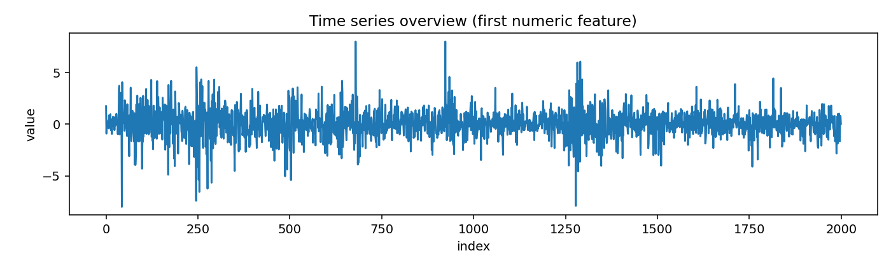
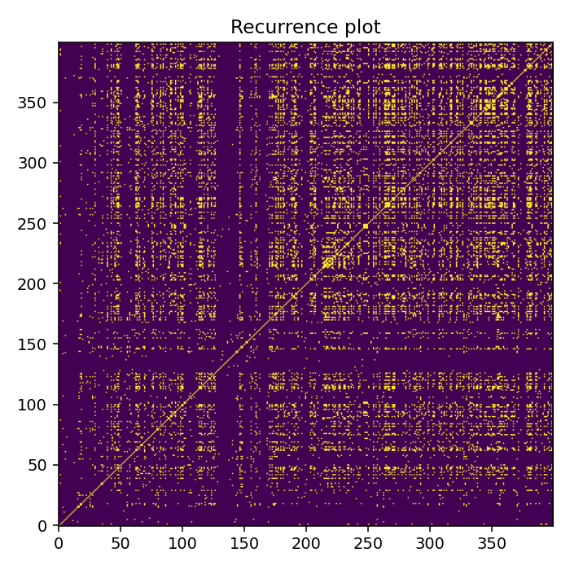
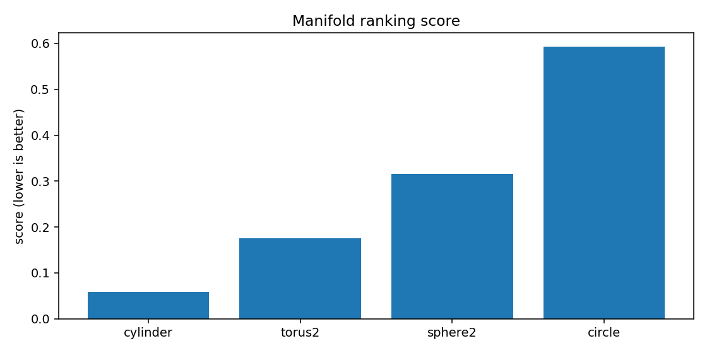
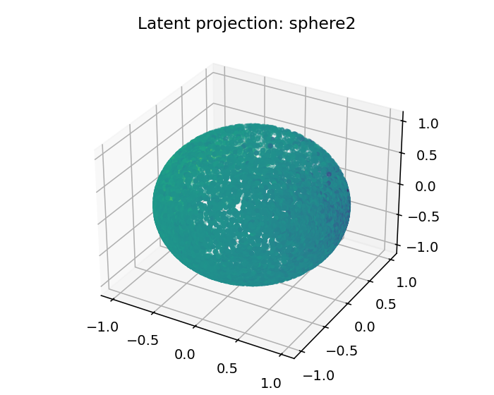
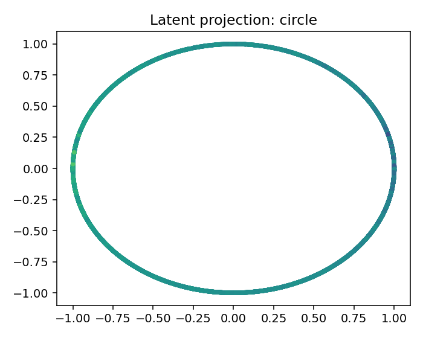

# ESO Report — BTCUSDT_1h_compact

## 1. Resumen ejecutivo
- Mejor geometría candidata: **cylinder**
- Score: `0.05905888750122545`
- Error reconstrucción: `0.05905886000122545`
- Dimensión intrínseca estimada: `4.0`
- Resumen diagnóstico: intrinsic_dimension≈4.000; stationarity=stationary; lyapunov=0.0510; chaotic_hint=True; periodic_hint=False; dominant_frequency=0.3168

## 2. Datos de entrada
- Fuente: `<dataframe>`
- Shape: `[9999, 4]`
- Columnas usadas: `['log_return', 'vol_20', 'vwap_dev', 'volume_imbalance']`

## 3. Ranking topológico
| rank | manifold | score | recon_error | std | smoothness | utilization |
|---:|---|---:|---:|---:|---:|---:|
| 1 | cylinder | 0.0590589 | 0.0590589 | 0.00211849 | 0.467244 | 0.20081 |
| 2 | torus2 | 0.175471 | 0.175471 | 0.00652928 | 1.2398 | 0.385995 |
| 3 | sphere2 | 0.315993 | 0.315993 | 0.0234869 | 2.13966 | 0.340856 |
| 4 | circle | 0.593206 | 0.593206 | 0.0279129 | 3.56253 | 0.305556 |

## 4. Visualizaciones
### time_series_overview

### recurrence_plot

### fft_spectrum

### autocorrelation

### manifold_ranking

### latent_projection_cylinder

### latent_projection_torus2

### latent_projection_sphere2

### latent_projection_circle

## 5. Interpretación
Best current candidate is cylinder with intrinsic dimension estimate 4.0.

Acción recomendada: Inspect report.html and run a second explore pass with more rows/masks if confidence is not high.