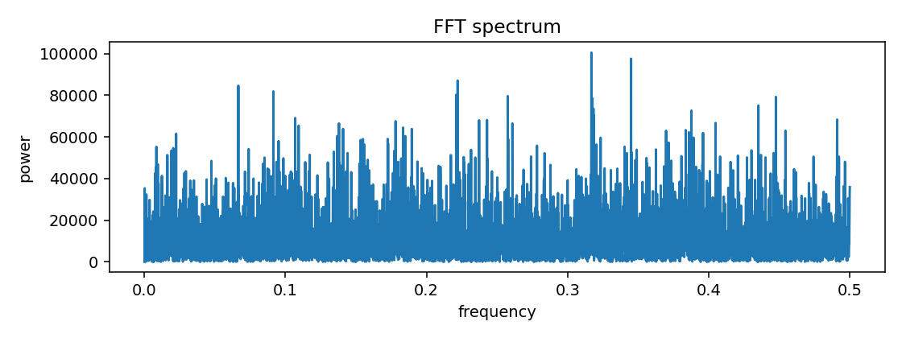
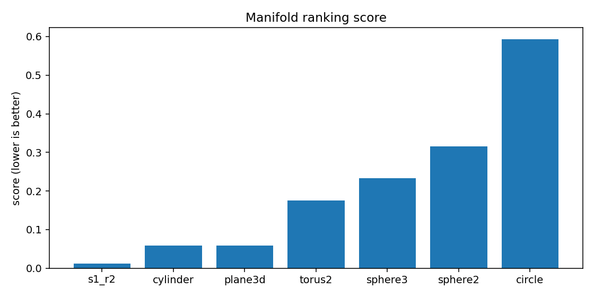
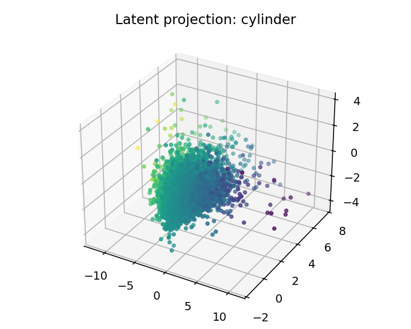
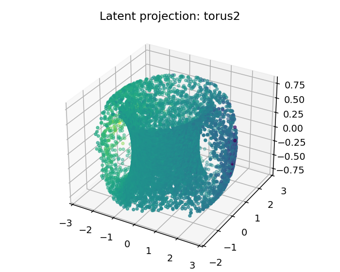

# ESO Report — BTCUSDT_1h_compact_extended

## 1. Resumen ejecutivo
- Mejor geometría candidata: **s1_r2**
- Score: `0.01272208465331389`
- Error reconstrucción: `0.012722044653313891`
- Dimensión intrínseca estimada: `4.0`
- Resumen diagnóstico: intrinsic_dimension≈4.000; stationarity=stationary; lyapunov=0.0510; chaotic_hint=True; periodic_hint=False; dominant_frequency=0.3168

## 2. Datos de entrada
- Fuente: `<dataframe>`
- Shape: `[9999, 4]`
- Columnas usadas: `['log_return', 'vol_20', 'vwap_dev', 'volume_imbalance']`

## 3. Ranking topológico
| rank | manifold | score | recon_error | std | smoothness | utilization |
|---:|---|---:|---:|---:|---:|---:|
| 1 | s1_r2 | 0.0127221 | 0.012722 | 0.00103347 | 0.175897 | 0.0806081 |
| 2 | cylinder | 0.0590589 | 0.0590589 | 0.00211849 | 0.467244 | 0.20081 |
| 3 | plane3d | 0.0591755 | 0.0591755 | 0.00400252 | 0.467244 | 0.20081 |
| 4 | torus2 | 0.175471 | 0.175471 | 0.00652928 | 1.2398 | 0.385995 |
| 5 | sphere3 | 0.233201 | 0.233201 | 0.00852695 | 1.6666 | 0.306731 |
| 6 | sphere2 | 0.315993 | 0.315993 | 0.0234869 | 2.13966 | 0.340856 |
| 7 | circle | 0.593206 | 0.593206 | 0.0279129 | 3.56253 | 0.305556 |

## 4. Visualizaciones
### time_series_overview

### recurrence_plot

### fft_spectrum

### autocorrelation

### manifold_ranking

### latent_projection_s1_r2

### latent_projection_cylinder

### latent_projection_plane3d

### latent_projection_torus2

## 5. Interpretación
Best current candidate is s1_r2 with intrinsic dimension estimate 4.0.

Acción recomendada: Inspect report.html and run a second explore pass with more rows/masks if confidence is not high.