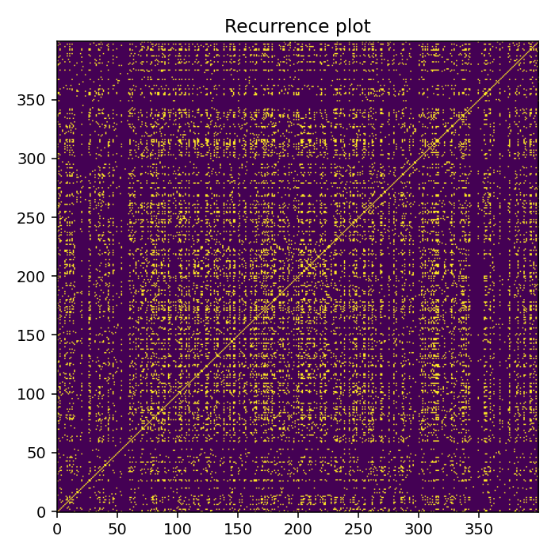
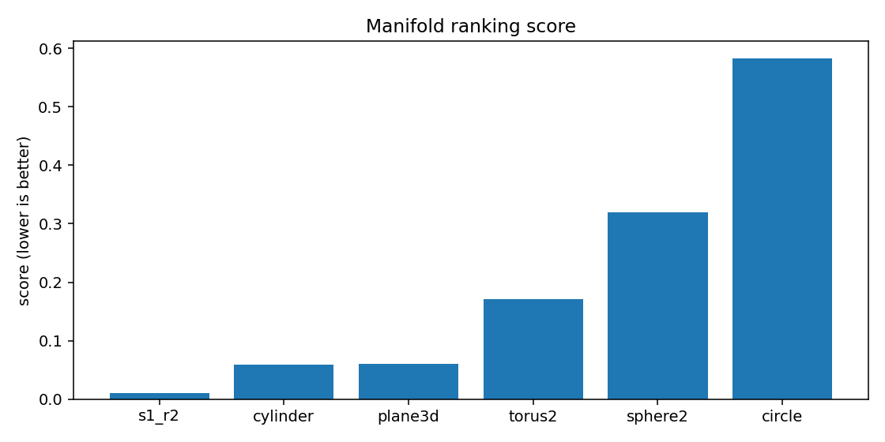
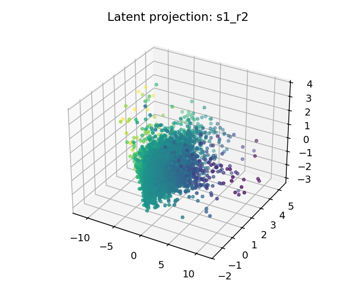

# ESO Report — BTCUSDT_1h_late_compact

## 1. Resumen ejecutivo
- Mejor geometría candidata: **s1_r2**
- Score: `0.010097149141713491`
- Error reconstrucción: `0.010097109141713492`
- Dimensión intrínseca estimada: `4.0`
- Resumen diagnóstico: intrinsic_dimension≈4.000; stationarity=stationary; lyapunov=0.0519; chaotic_hint=True; periodic_hint=False; dominant_frequency=0.3996

## 2. Datos de entrada
- Fuente: `<dataframe>`
- Shape: `[9999, 4]`
- Columnas usadas: `['log_return', 'vol_20', 'vwap_dev', 'volume_imbalance']`

## 3. Ranking topológico
| rank | manifold | score | recon_error | std | smoothness | utilization |
|---:|---|---:|---:|---:|---:|---:|
| 1 | s1_r2 | 0.0100971 | 0.0100971 | 0.000805474 | 0.153275 | 0.0841084 |
| 2 | cylinder | 0.0591587 | 0.0591587 | 0.00212686 | 0.455811 | 0.251157 |
| 3 | plane3d | 0.0601392 | 0.0601392 | 0.00175455 | 0.455811 | 0.251157 |
| 4 | torus2 | 0.171676 | 0.171676 | 0.00535404 | 1.20415 | 0.384259 |
| 5 | sphere2 | 0.318986 | 0.318986 | 0.0116881 | 2.16211 | 0.343171 |
| 6 | circle | 0.582838 | 0.582838 | 0.0243271 | 3.57513 | 0.305556 |

## 4. Visualizaciones
### time_series_overview

### recurrence_plot

### fft_spectrum

### autocorrelation

### manifold_ranking

### latent_projection_s1_r2

### latent_projection_cylinder

### latent_projection_plane3d

### latent_projection_torus2

## 5. Interpretación
Best current candidate is s1_r2 with intrinsic dimension estimate 4.0.

Acción recomendada: Inspect report.html and run a second explore pass with more rows/masks if confidence is not high.