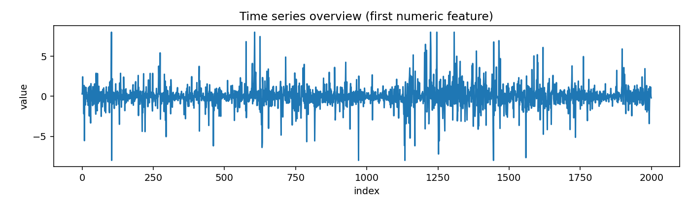
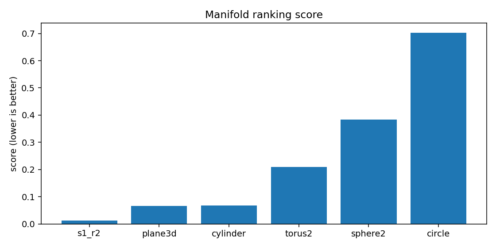
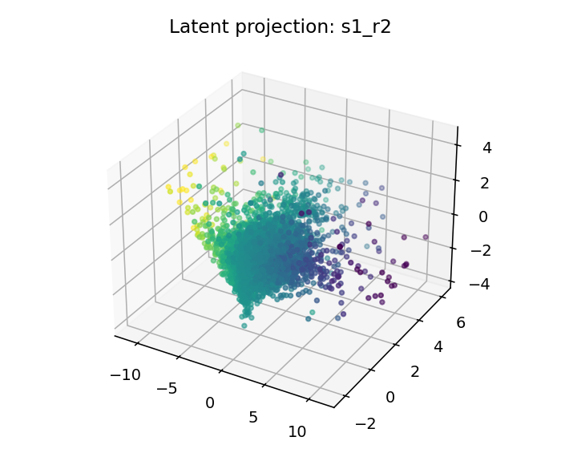
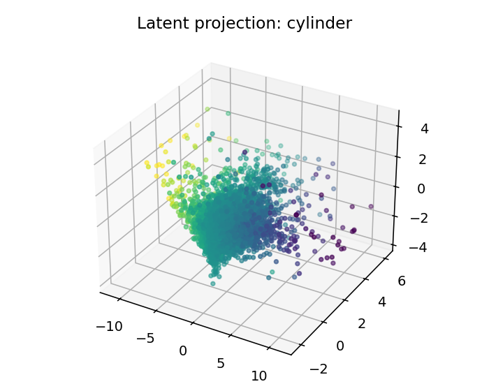
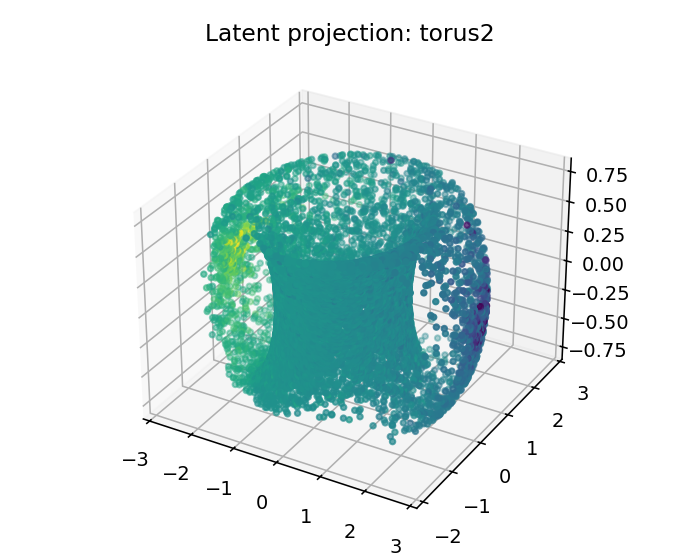

# ESO Report — BTCUSDT_1h_mid_compact

## 1. Resumen ejecutivo
- Mejor geometría candidata: **s1_r2**
- Score: `0.012642610018133476`
- Error reconstrucción: `0.012642570018133476`
- Dimensión intrínseca estimada: `3.941986960388802`
- Resumen diagnóstico: intrinsic_dimension≈3.942; stationarity=stationary; lyapunov=0.0538; chaotic_hint=True; periodic_hint=False; dominant_frequency=0.0739

## 2. Datos de entrada
- Fuente: `<dataframe>`
- Shape: `[9999, 4]`
- Columnas usadas: `['log_return', 'vol_20', 'vwap_dev', 'volume_imbalance']`

## 3. Ranking topológico
| rank | manifold | score | recon_error | std | smoothness | utilization |
|---:|---|---:|---:|---:|---:|---:|
| 1 | s1_r2 | 0.0126426 | 0.0126426 | 0.00170596 | 0.174946 | 0.0684068 |
| 2 | plane3d | 0.066353 | 0.0663529 | 0.00513836 | 0.513486 | 0.206597 |
| 3 | cylinder | 0.0682527 | 0.0682526 | 0.00383445 | 0.513486 | 0.206597 |
| 4 | torus2 | 0.208857 | 0.208857 | 0.00812526 | 1.49788 | 0.372685 |
| 5 | sphere2 | 0.383384 | 0.383384 | 0.0180696 | 2.72008 | 0.335069 |
| 6 | circle | 0.702767 | 0.702767 | 0.0201675 | 4.24703 | 0.305556 |

## 4. Visualizaciones
### time_series_overview

### recurrence_plot

### fft_spectrum

### autocorrelation

### manifold_ranking

### latent_projection_s1_r2

### latent_projection_plane3d

### latent_projection_cylinder

### latent_projection_torus2

## 5. Interpretación
Best current candidate is s1_r2 with intrinsic dimension estimate 3.941986960388802.

Acción recomendada: Inspect report.html and run a second explore pass with more rows/masks if confidence is not high.