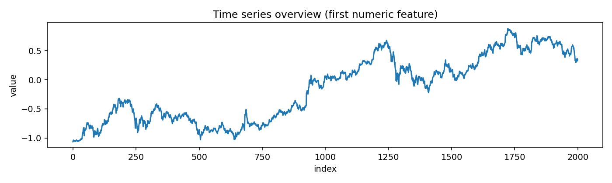
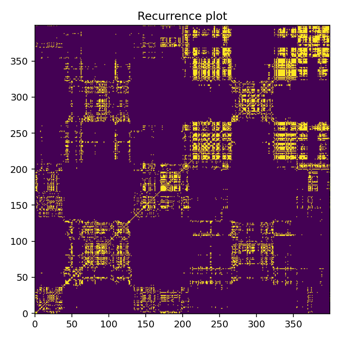
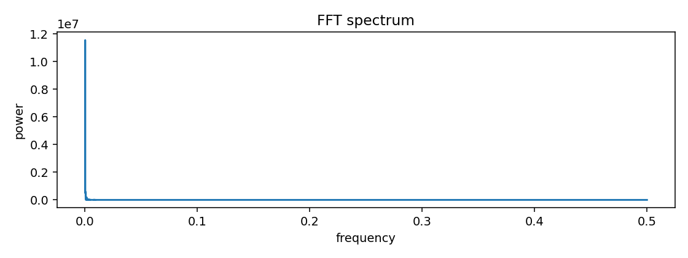
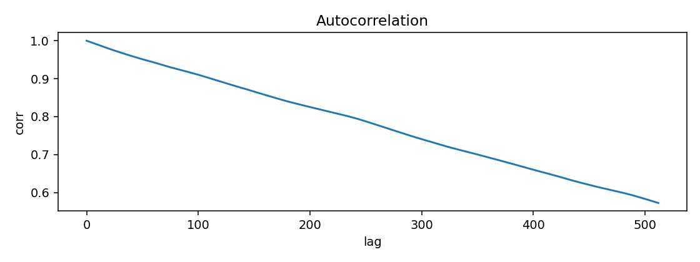
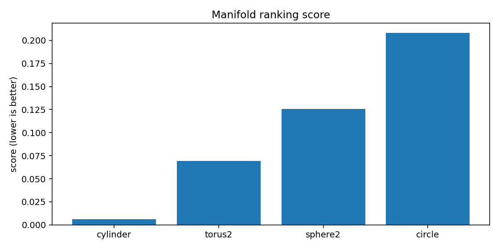
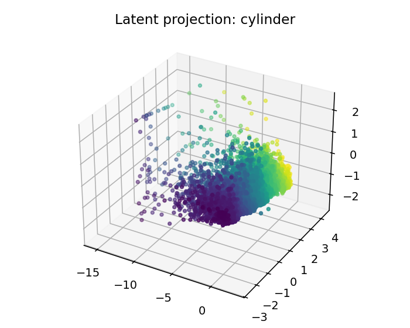
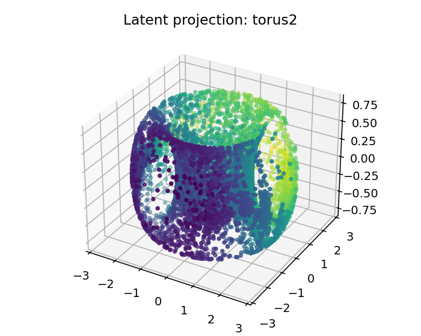
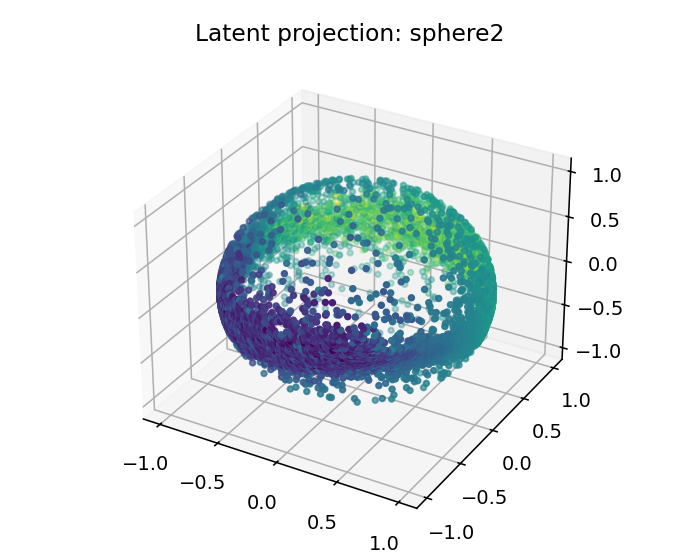
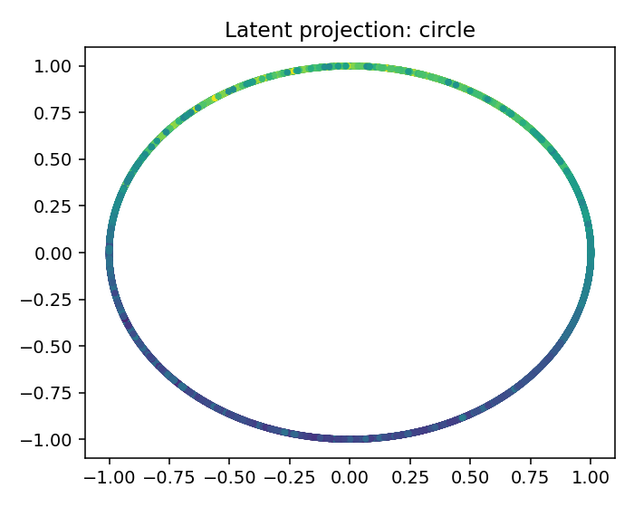

# ESO Report — BTCUSDT_1h_ohlcv

## 1. Resumen ejecutivo
- Mejor geometría candidata: **cylinder**
- Score: `0.006116081470090906`
- Error reconstrucción: `0.006116053970090905`
- Dimensión intrínseca estimada: `2.0`
- Resumen diagnóstico: intrinsic_dimension≈2.000; stationarity=trend_or_unit_root; lyapunov=0.0945; chaotic_hint=True; periodic_hint=False; dominant_frequency=0.0002

## 2. Datos de entrada
- Fuente: `<dataframe>`
- Shape: `[10000, 9]`
- Columnas usadas: `['open', 'high', 'low', 'close', 'volume', 'n_trades', 'vwap', 'taker_buy_volume', 'taker_sell_volume']`

## 3. Ranking topológico
| rank | manifold | score | recon_error | std | smoothness | utilization |
|---:|---|---:|---:|---:|---:|---:|
| 1 | cylinder | 0.00611608 | 0.00611605 | 0.000397872 | 0.119805 | 0.215278 |
| 2 | torus2 | 0.0694343 | 0.0694343 | 0.0102569 | 1.16831 | 0.418981 |
| 3 | sphere2 | 0.125958 | 0.125958 | 0.00775279 | 2.10278 | 0.251157 |
| 4 | circle | 0.208222 | 0.208222 | 0.016698 | 2.99659 | 0.305556 |

## 4. Visualizaciones
### time_series_overview

### recurrence_plot

### fft_spectrum

### autocorrelation

### manifold_ranking

### latent_projection_cylinder

### latent_projection_torus2

### latent_projection_sphere2

### latent_projection_circle

## 5. Interpretación
Best current candidate is cylinder with intrinsic dimension estimate 2.0.

Acción recomendada: Inspect report.html and run a second explore pass with more rows/masks if confidence is not high.