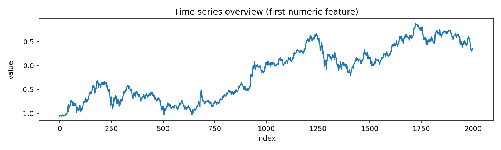
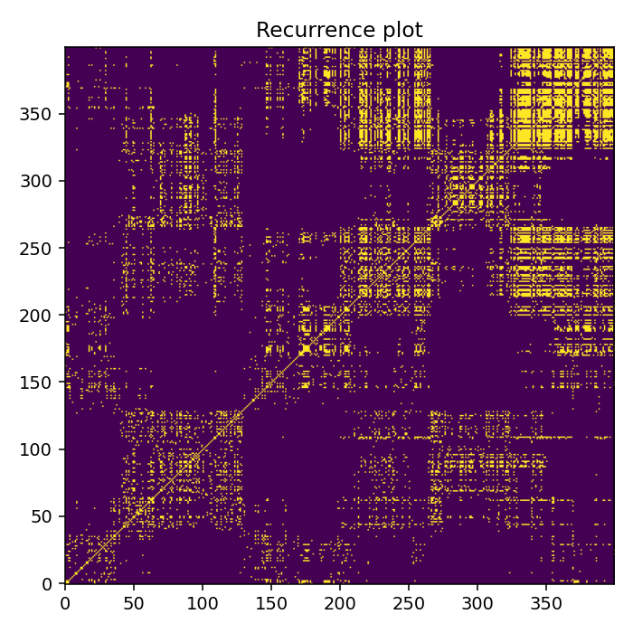
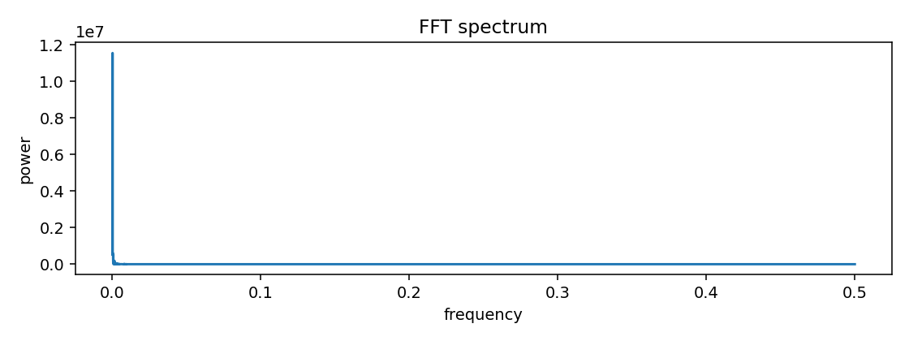
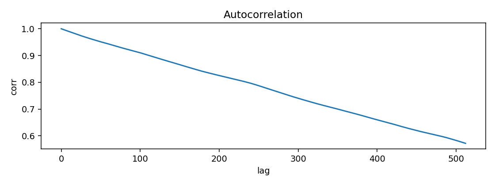
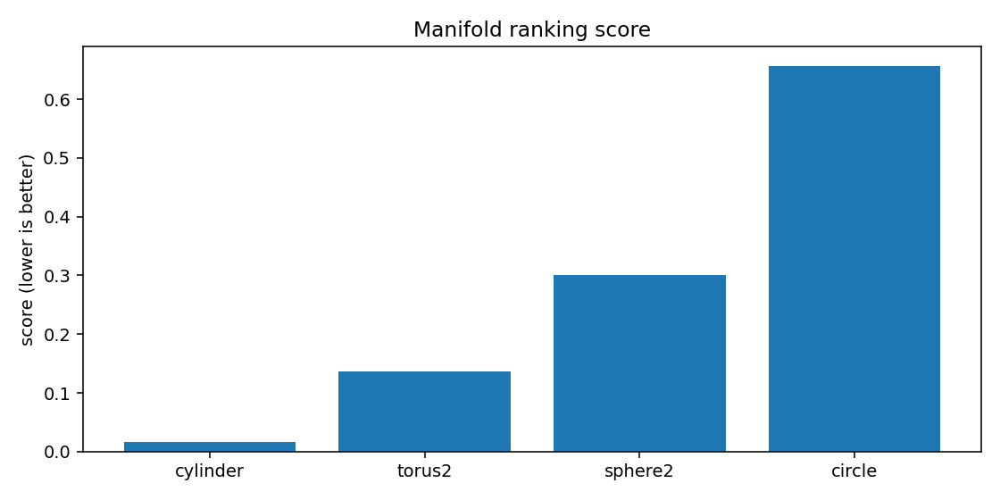
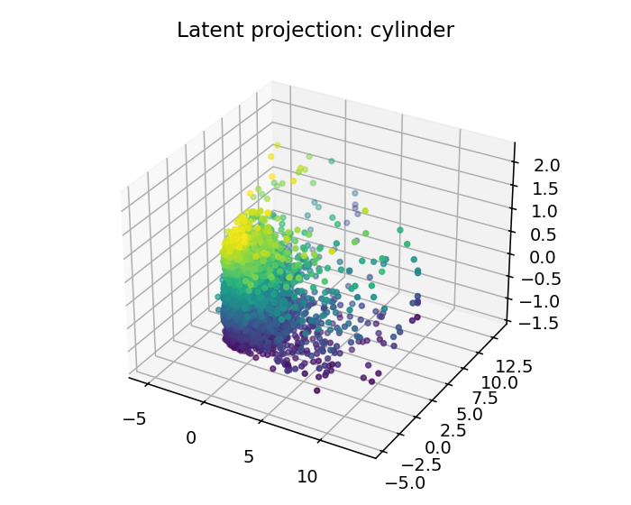
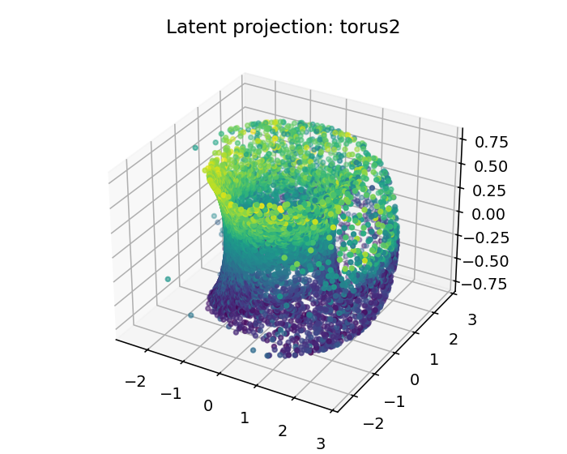
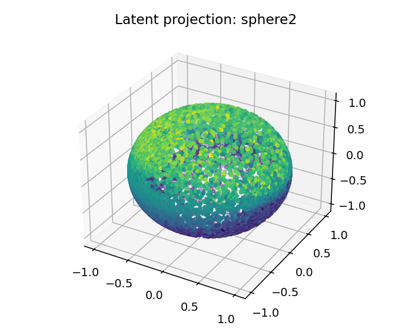
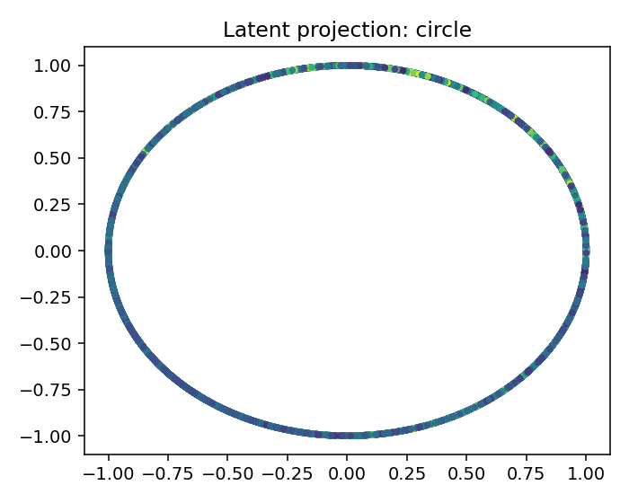

# ESO Report — BTCUSDT_1h_reduced

## 1. Resumen ejecutivo
- Mejor geometría candidata: **cylinder**
- Score: `0.016324814384808817`
- Error reconstrucción: `0.016324786884808817`
- Dimensión intrínseca estimada: `3.0`
- Resumen diagnóstico: intrinsic_dimension≈3.000; stationarity=trend_or_unit_root; lyapunov=0.0946; chaotic_hint=True; periodic_hint=False; dominant_frequency=0.0002

## 2. Datos de entrada
- Fuente: `data/BTCUSDT_1h.csv`
- Shape: `[10000, 4]`
- Columnas usadas: `['close', 'volume', 'n_trades', 'delta']`

## 3. Ranking topológico
| rank | manifold | score | recon_error | std | smoothness | utilization |
|---:|---|---:|---:|---:|---:|---:|
| 1 | cylinder | 0.0163248 | 0.0163248 | 0.000362225 | 0.165992 | 0.233796 |
| 2 | torus2 | 0.136743 | 0.136742 | 0.00906418 | 1.03369 | 0.356481 |
| 3 | sphere2 | 0.300787 | 0.300787 | 0.00922498 | 2.11209 | 0.338542 |
| 4 | circle | 0.656701 | 0.656701 | 0.0303773 | 4.10065 | 0.305556 |

## 4. Visualizaciones
### time_series_overview

### recurrence_plot

### fft_spectrum

### autocorrelation

### manifold_ranking

### latent_projection_cylinder

### latent_projection_torus2

### latent_projection_sphere2

### latent_projection_circle

## 5. Interpretación
Best current candidate is cylinder with intrinsic dimension estimate 3.0.

Acción recomendada: Inspect report.html and run a second explore pass with more rows/masks if confidence is not high.