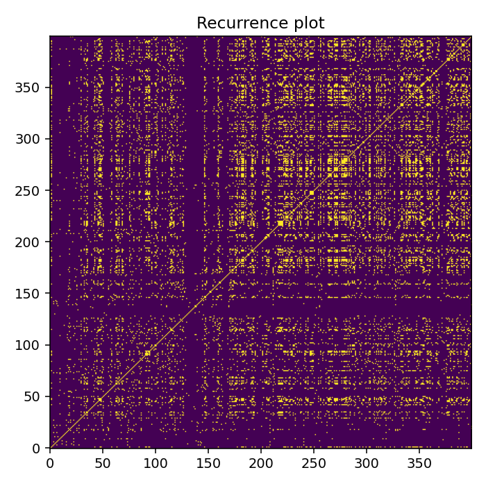
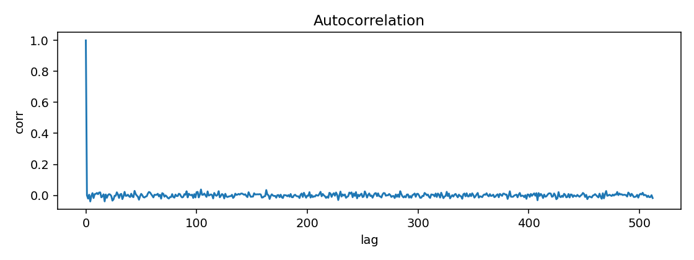
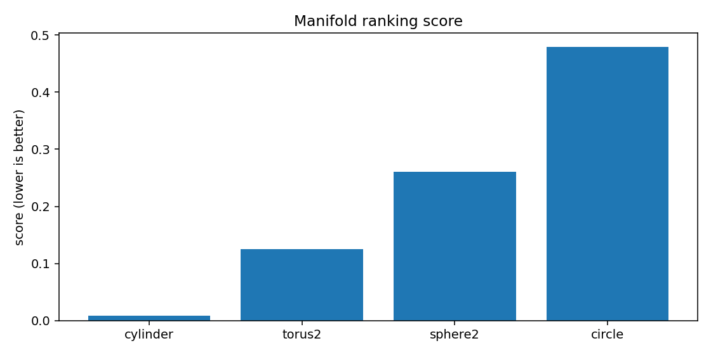
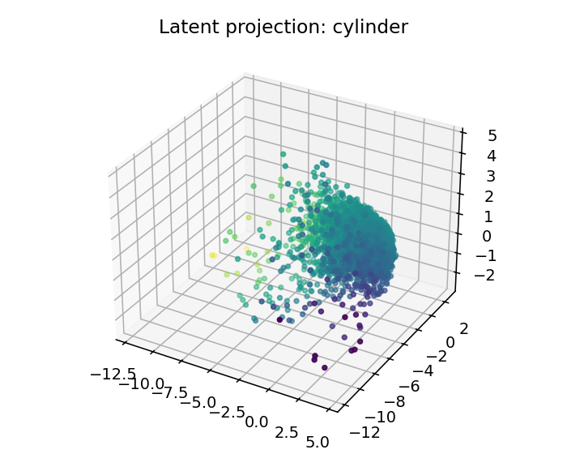
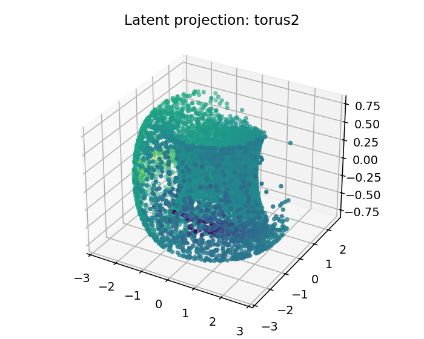
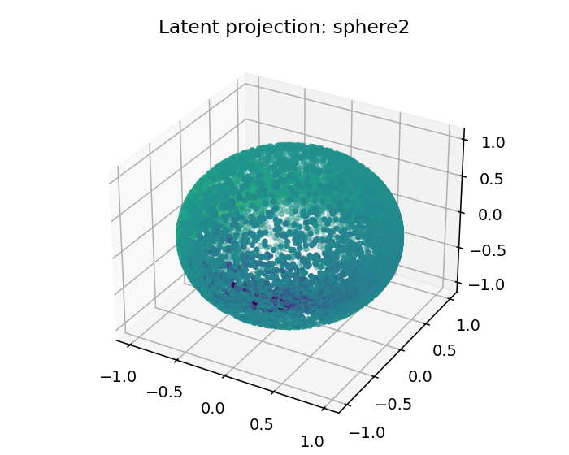
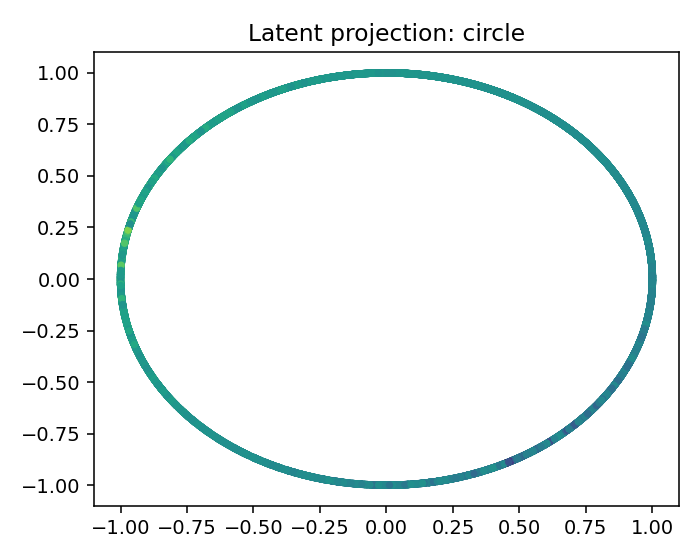

# ESO Report — BTCUSDT_1h_returns_vol

## 1. Resumen ejecutivo
- Mejor geometría candidata: **cylinder**
- Score: `0.00889042259109474`
- Error reconstrucción: `0.00889039509109474`
- Dimensión intrínseca estimada: `3.0`
- Resumen diagnóstico: intrinsic_dimension≈3.000; stationarity=stationary; lyapunov=0.0510; chaotic_hint=True; periodic_hint=False; dominant_frequency=0.3168

## 2. Datos de entrada
- Fuente: `<dataframe>`
- Shape: `[9999, 4]`
- Columnas usadas: `['log_return', 'vol_5', 'vol_20', 'lr_z20']`

## 3. Ranking topológico
| rank | manifold | score | recon_error | std | smoothness | utilization |
|---:|---|---:|---:|---:|---:|---:|
| 1 | cylinder | 0.00889042 | 0.0088904 | 0.000572479 | 0.115552 | 0.178819 |
| 2 | torus2 | 0.124888 | 0.124888 | 0.00934955 | 0.874992 | 0.365162 |
| 3 | sphere2 | 0.26072 | 0.26072 | 0.0152162 | 1.80373 | 0.334491 |
| 4 | circle | 0.479194 | 0.479194 | 0.0316208 | 2.90884 | 0.305556 |

## 4. Visualizaciones
### time_series_overview

### recurrence_plot

### fft_spectrum

### autocorrelation

### manifold_ranking

### latent_projection_cylinder

### latent_projection_torus2

### latent_projection_sphere2

### latent_projection_circle

## 5. Interpretación
Best current candidate is cylinder with intrinsic dimension estimate 3.0.

Acción recomendada: Inspect report.html and run a second explore pass with more rows/masks if confidence is not high.