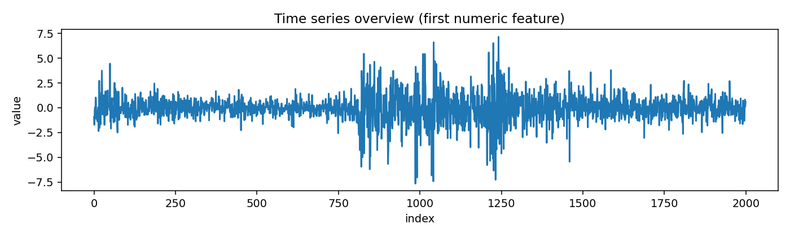
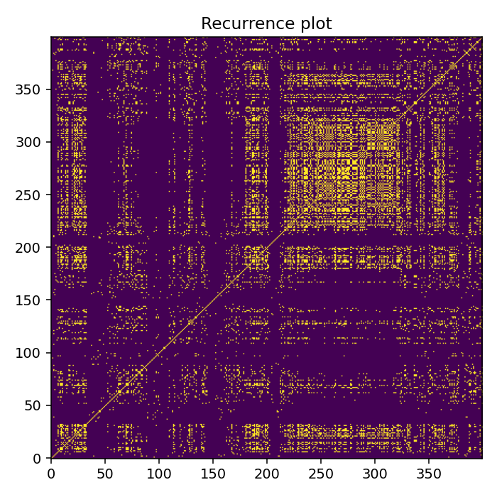
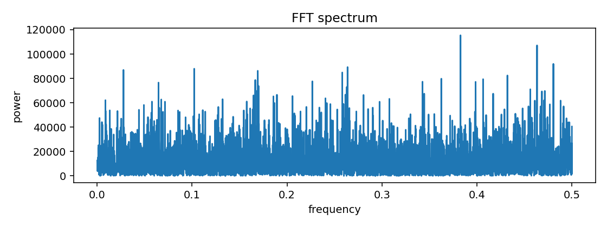
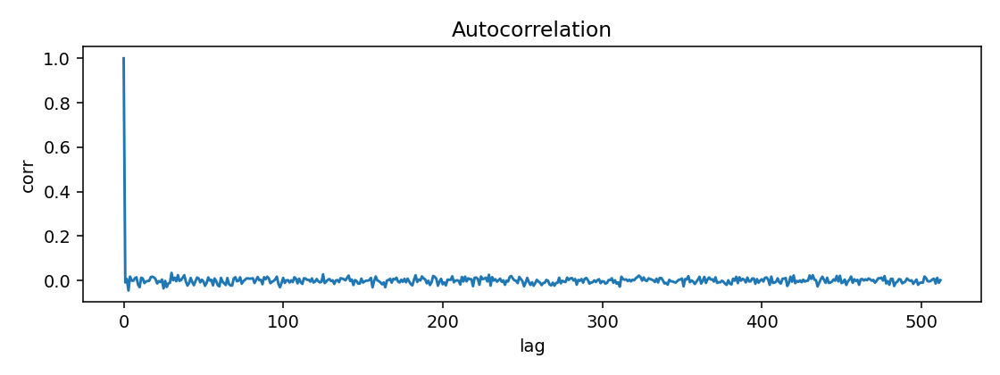
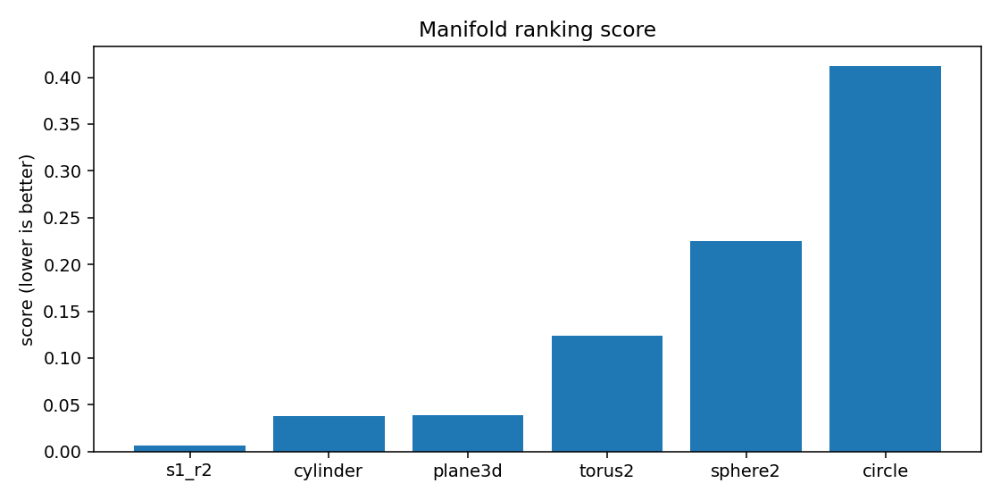
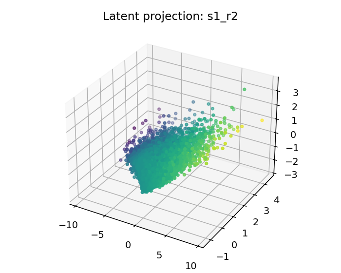
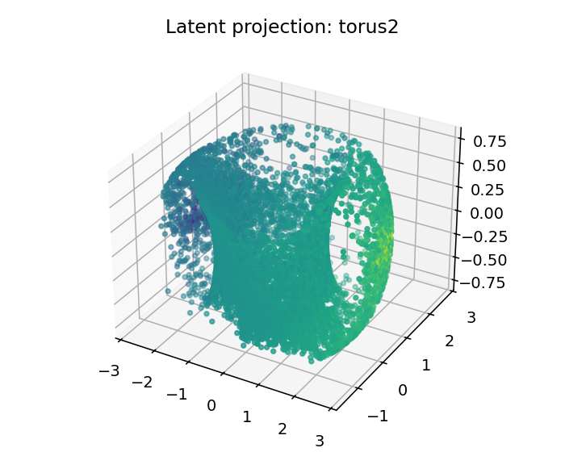

# ESO Report — BTCUSDT_3m_early_compact

## 1. Resumen ejecutivo
- Mejor geometría candidata: **s1_r2**
- Score: `0.006564732767001858`
- Error reconstrucción: `0.006564692767001858`
- Dimensión intrínseca estimada: `3.6293517254587324`
- Resumen diagnóstico: intrinsic_dimension≈3.629; stationarity=stationary; lyapunov=0.0498; chaotic_hint=True; periodic_hint=False; dominant_frequency=0.3826

## 2. Datos de entrada
- Fuente: `<dataframe>`
- Shape: `[9999, 4]`
- Columnas usadas: `['log_return', 'vol_20', 'vwap_dev', 'volume_imbalance']`

## 3. Ranking topológico
| rank | manifold | score | recon_error | std | smoothness | utilization |
|---:|---|---:|---:|---:|---:|---:|
| 1 | s1_r2 | 0.00656473 | 0.00656469 | 0.000697948 | 0.101894 | 0.0844084 |
| 2 | cylinder | 0.037852 | 0.037852 | 0.00137596 | 0.295245 | 0.220486 |
| 3 | plane3d | 0.0387675 | 0.0387675 | 0.000986935 | 0.295245 | 0.220486 |
| 4 | torus2 | 0.123626 | 0.123626 | 0.0063281 | 0.824534 | 0.36169 |
| 5 | sphere2 | 0.224586 | 0.224586 | 0.0118362 | 1.55786 | 0.329282 |
| 6 | circle | 0.412096 | 0.412096 | 0.0147994 | 2.54888 | 0.305556 |

## 4. Visualizaciones
### time_series_overview

### recurrence_plot

### fft_spectrum

### autocorrelation

### manifold_ranking

### latent_projection_s1_r2

### latent_projection_cylinder

### latent_projection_plane3d

### latent_projection_torus2

## 5. Interpretación
Best current candidate is s1_r2 with intrinsic dimension estimate 3.6293517254587324.

Acción recomendada: Inspect report.html and run a second explore pass with more rows/masks if confidence is not high.