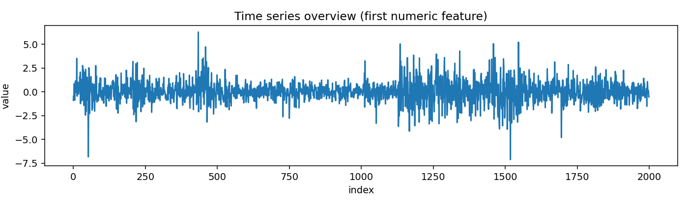
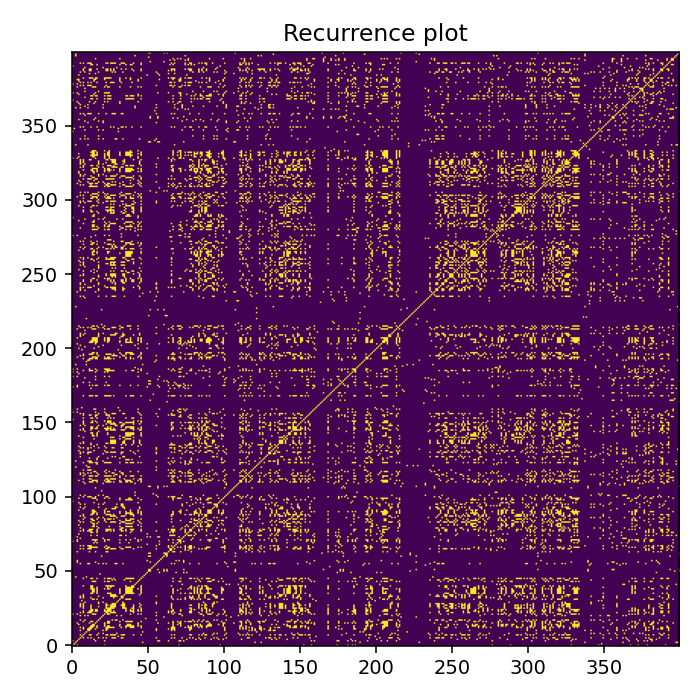
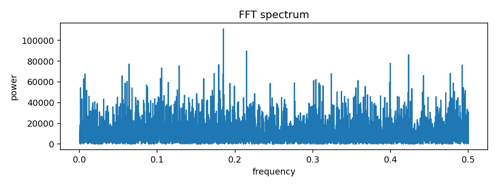
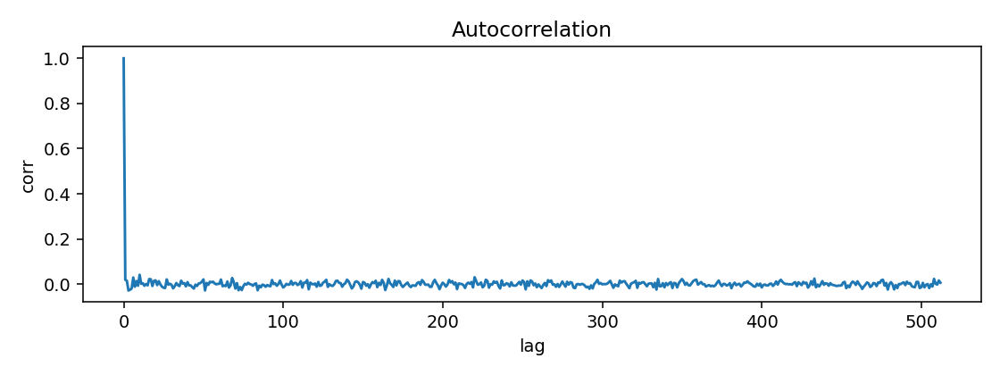
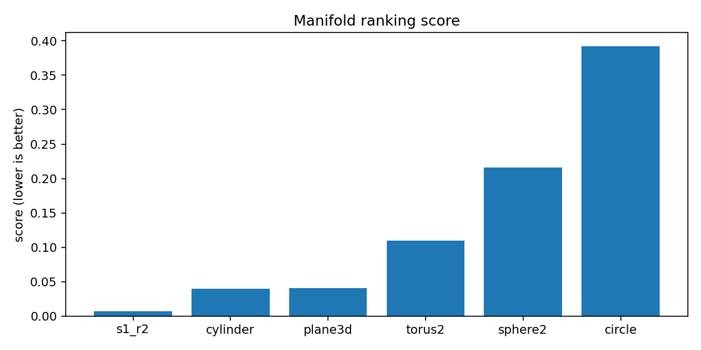
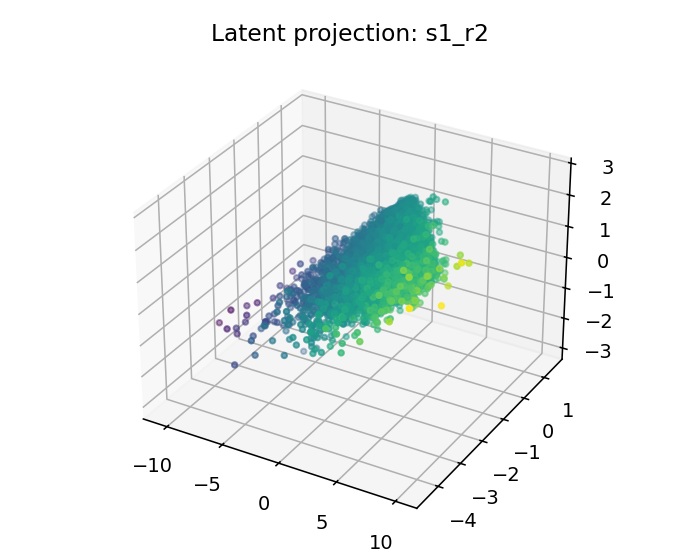
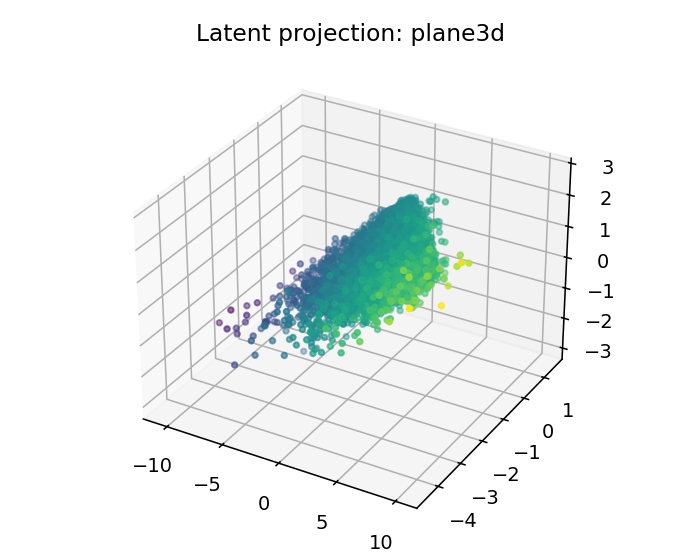
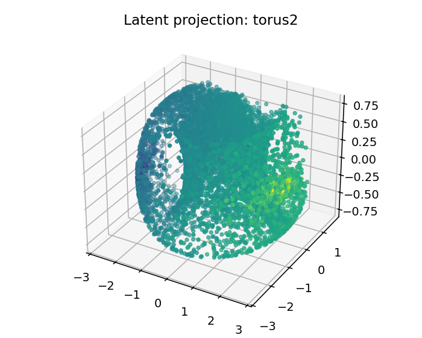

# ESO Report — BTCUSDT_3m_late_compact

## 1. Resumen ejecutivo
- Mejor geometría candidata: **s1_r2**
- Score: `0.007104647300147453`
- Error reconstrucción: `0.0071046073001474535`
- Dimensión intrínseca estimada: `3.9243974276301072`
- Resumen diagnóstico: intrinsic_dimension≈3.924; stationarity=stationary; lyapunov=0.0496; chaotic_hint=True; periodic_hint=False; dominant_frequency=0.1850

## 2. Datos de entrada
- Fuente: `<dataframe>`
- Shape: `[9999, 4]`
- Columnas usadas: `['log_return', 'vol_20', 'vwap_dev', 'volume_imbalance']`

## 3. Ranking topológico
| rank | manifold | score | recon_error | std | smoothness | utilization |
|---:|---|---:|---:|---:|---:|---:|
| 1 | s1_r2 | 0.00710465 | 0.00710461 | 0.000881629 | 0.105326 | 0.0912091 |
| 2 | cylinder | 0.0397971 | 0.0397971 | 0.00143553 | 0.307922 | 0.209491 |
| 3 | plane3d | 0.0403299 | 0.0403299 | 0.00146716 | 0.307922 | 0.209491 |
| 4 | torus2 | 0.109479 | 0.109479 | 0.00530588 | 0.781932 | 0.390625 |
| 5 | sphere2 | 0.216215 | 0.216215 | 0.0127988 | 1.42303 | 0.336227 |
| 6 | circle | 0.392254 | 0.392254 | 0.00994089 | 2.36355 | 0.305556 |

## 4. Visualizaciones
### time_series_overview

### recurrence_plot

### fft_spectrum

### autocorrelation

### manifold_ranking

### latent_projection_s1_r2

### latent_projection_cylinder

### latent_projection_plane3d

### latent_projection_torus2

## 5. Interpretación
Best current candidate is s1_r2 with intrinsic dimension estimate 3.9243974276301072.

Acción recomendada: Inspect report.html and run a second explore pass with more rows/masks if confidence is not high.