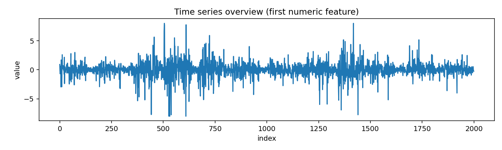
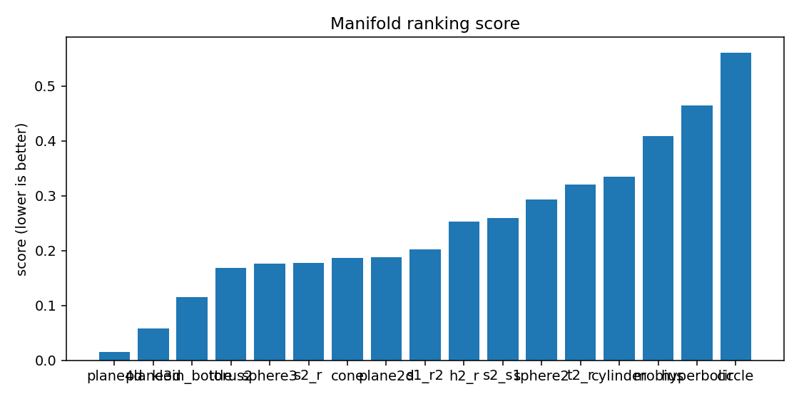
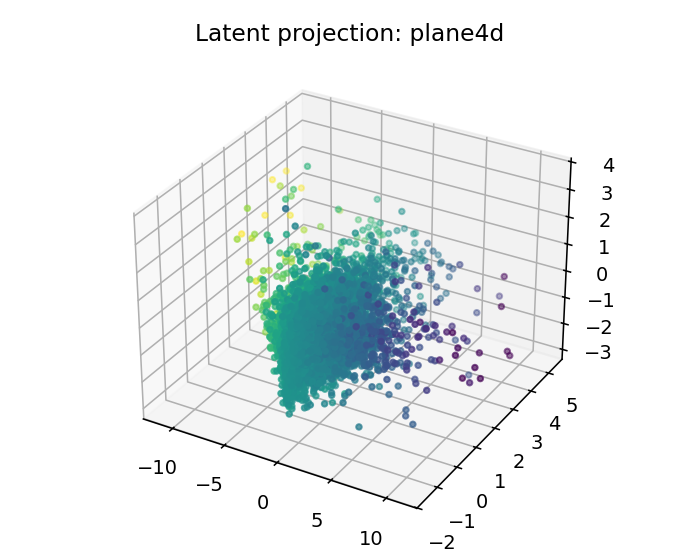
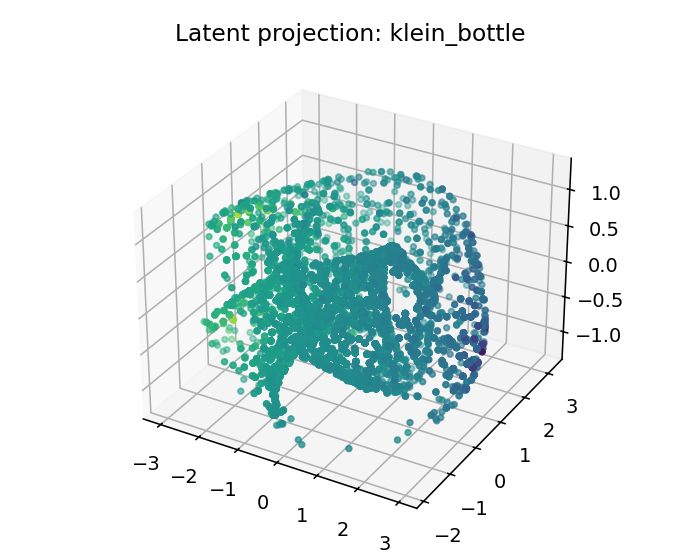
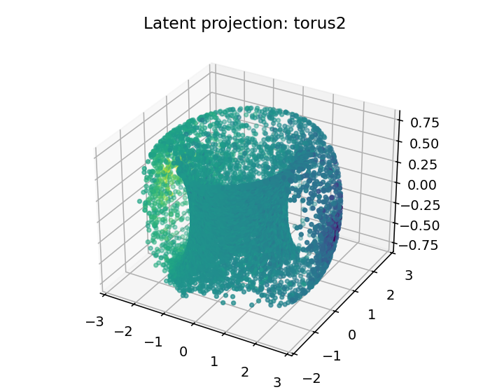

# ESO Report — BTC_1h_late_isomap

## 1. Resumen ejecutivo
- Mejor geometría candidata: **plane4d**
- Score: `0.015344798309785815`
- Error reconstrucción: `0.015344748309785813`
- Dimensión intrínseca estimada: `4.0`
- Resumen diagnóstico: intrinsic_dimension≈4.000; stationarity=stationary; lyapunov=0.0519; chaotic_hint=True; periodic_hint=False; dominant_frequency=0.3996

## 2. Datos de entrada
- Fuente: `<dataframe>`
- Shape: `[9999, 4]`
- Columnas usadas: `['log_return', 'vol_20', 'vwap_dev', 'volume_imbalance']`

## 3. Ranking topológico
| rank | manifold | score | recon_error | std | smoothness | utilization |
|---:|---|---:|---:|---:|---:|---:|
| 1 | plane4d | 0.0153448 | 0.0153447 | 0.000960298 | 0.175452 | 0.0730073 |
| 2 | plane3d | 0.0583742 | 0.0583742 | 0.00272234 | 0.439976 | 0.215278 |
| 3 | klein_bottle | 0.115036 | 0.115036 | 0.0061475 | 0.935869 | 0.40162 |
| 4 | torus2 | 0.168969 | 0.168969 | 0.00922759 | 1.20657 | 0.387153 |
| 5 | sphere3 | 0.175762 | 0.175762 | 0.00635881 | 1.3519 | 0.281528 |
| 6 | s2_r | 0.176919 | 0.176919 | 0.00417577 | 1.38265 | 0.140914 |
| 7 | cone | 0.186324 | 0.186323 | 0.00174799 | 1.29828 | 0.106481 |
| 8 | plane2d | 0.188007 | 0.188007 | 0.00503395 | 1.30895 | 0.6875 |
| 9 | s1_r2 | 0.201996 | 0.201996 | 0.00586615 | 1.54873 | 0.0814081 |
| 10 | h2_r | 0.252513 | 0.252513 | 0.0115203 | 1.83289 | 0.443866 |
| 11 | s2_s1 | 0.259649 | 0.259649 | 0.0138811 | 1.75354 | 0.109611 |
| 12 | sphere2 | 0.292525 | 0.292525 | 0.0206768 | 2.0324 | 0.344907 |
| 13 | t2_r | 0.320277 | 0.320277 | 0.0121894 | 2.22952 | 0.167817 |
| 14 | cylinder | 0.334316 | 0.334316 | 0.0181235 | 2.33133 | 0.184606 |
| 15 | mobius | 0.408549 | 0.408549 | 0.0183023 | 2.48816 | 0.207176 |
| 16 | hyperbolic | 0.464378 | 0.464378 | 0.0132696 | 2.91826 | 0.916667 |
| 17 | circle | 0.560845 | 0.560845 | 0.0176408 | 3.53654 | 0.305556 |

## 4. Visualizaciones
### time_series_overview

### recurrence_plot

### fft_spectrum

### autocorrelation

### manifold_ranking

### latent_projection_plane4d

### latent_projection_plane3d

### latent_projection_klein_bottle

### latent_projection_torus2

## 5. Interpretación
Best current candidate is plane4d with intrinsic dimension estimate 4.0.

Acción recomendada: Inspect report.html and run a second explore pass with more rows/masks if confidence is not high.