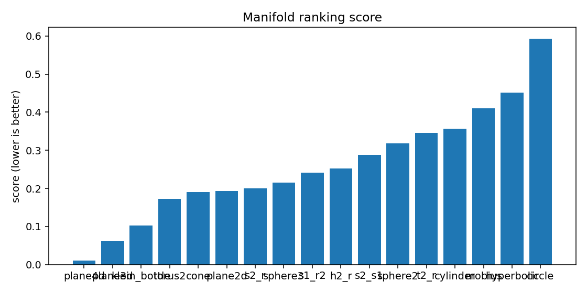

# ESO Report — BTC_1h_late_linear

## 1. Resumen ejecutivo
- Mejor geometría candidata: **plane4d**
- Score: `0.010793962466103856`
- Error reconstrucción: `0.010793912466103856`
- Dimensión intrínseca estimada: `4.0`
- Resumen diagnóstico: intrinsic_dimension≈4.000; stationarity=stationary; lyapunov=0.0519; chaotic_hint=True; periodic_hint=False; dominant_frequency=0.3996

## 2. Datos de entrada
- Fuente: `<dataframe>`
- Shape: `[9999, 4]`
- Columnas usadas: `['log_return', 'vol_20', 'vwap_dev', 'volume_imbalance']`

## 3. Ranking topológico
| rank | manifold | score | recon_error | std | smoothness | utilization |
|---:|---|---:|---:|---:|---:|---:|
| 1 | plane4d | 0.010794 | 0.0107939 | 0.000806624 | 0.153275 | 0.0841084 |
| 2 | plane3d | 0.0610337 | 0.0610337 | 0.00291015 | 0.455811 | 0.251157 |
| 3 | klein_bottle | 0.102585 | 0.102585 | 0.00468706 | 0.847713 | 0.371528 |
| 4 | torus2 | 0.172157 | 0.172157 | 0.00629127 | 1.20415 | 0.384259 |
| 5 | cone | 0.189714 | 0.189714 | 0.00257512 | 1.32823 | 0.102431 |
| 6 | plane2d | 0.192553 | 0.192553 | 0.00572094 | 1.35331 | 0.743056 |
| 7 | s2_r | 0.19947 | 0.19947 | 0.00769054 | 1.51916 | 0.137714 |
| 8 | sphere3 | 0.214662 | 0.214662 | 0.00804785 | 1.61179 | 0.309531 |
| 9 | s1_r2 | 0.241122 | 0.241122 | 0.00654553 | 1.75223 | 0.0860086 |
| 10 | h2_r | 0.252184 | 0.252184 | 0.0078138 | 1.79988 | 0.494213 |
| 11 | s2_s1 | 0.287314 | 0.287314 | 0.00904195 | 1.87969 | 0.109911 |
| 12 | sphere2 | 0.318282 | 0.318282 | 0.0165876 | 2.16211 | 0.343171 |
| 13 | t2_r | 0.345443 | 0.345443 | 0.00855977 | 2.4079 | 0.174517 |
| 14 | cylinder | 0.356324 | 0.356324 | 0.0171929 | 2.42507 | 0.208912 |
| 15 | mobius | 0.410144 | 0.410144 | 0.0149514 | 2.44645 | 0.209491 |
| 16 | hyperbolic | 0.451905 | 0.451905 | 0.0199993 | 2.81674 | 0.916667 |
| 17 | circle | 0.593094 | 0.593094 | 0.0177933 | 3.57513 | 0.305556 |

## 4. Visualizaciones
### time_series_overview

### recurrence_plot

### fft_spectrum

### autocorrelation

### manifold_ranking

### latent_projection_plane4d

### latent_projection_plane3d

### latent_projection_klein_bottle

### latent_projection_torus2

## 5. Interpretación
Best current candidate is plane4d with intrinsic dimension estimate 4.0.

Acción recomendada: Inspect report.html and run a second explore pass with more rows/masks if confidence is not high.