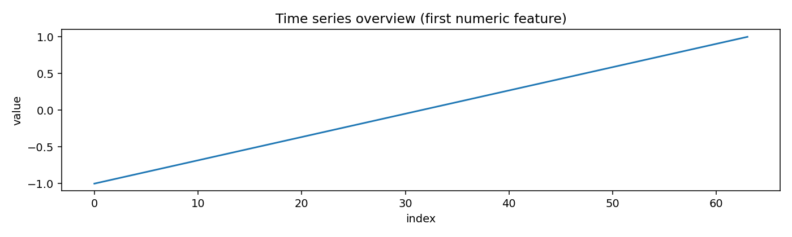
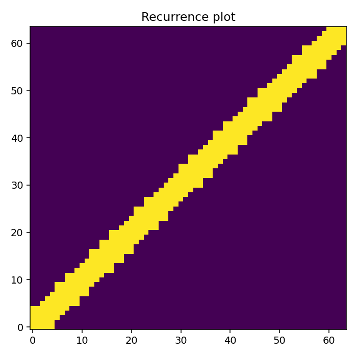
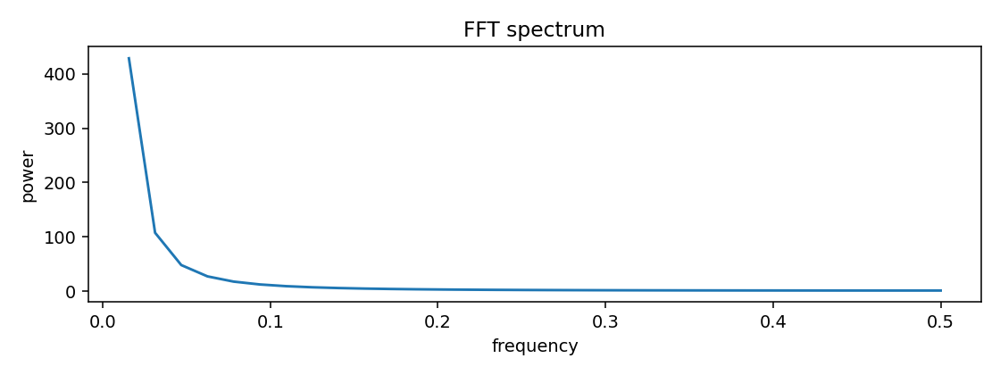
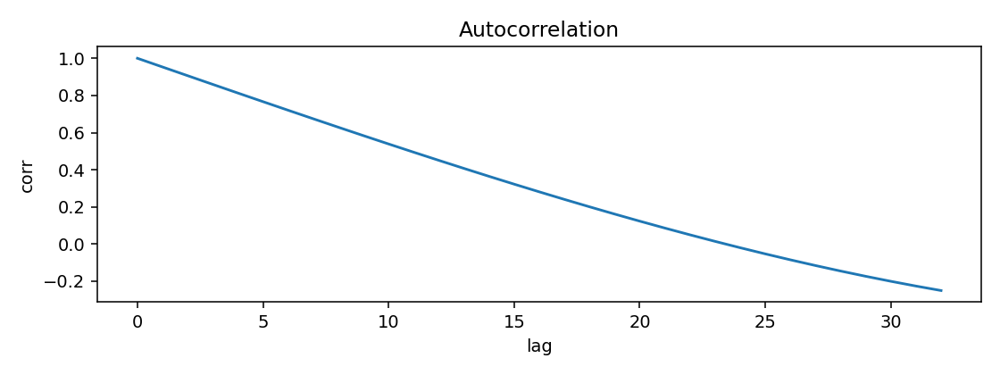
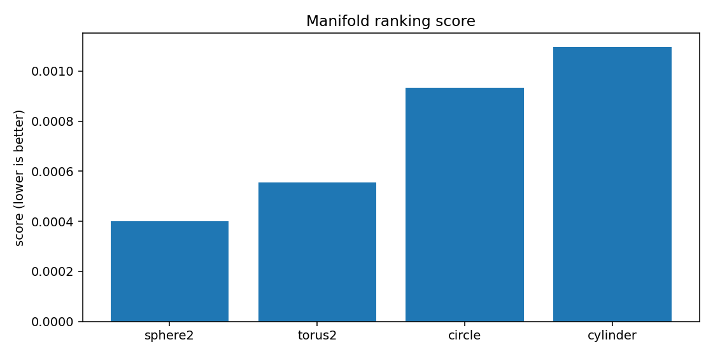
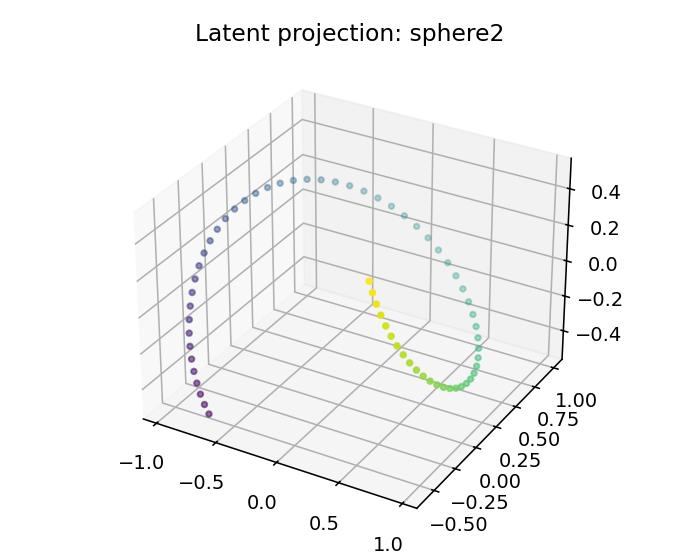
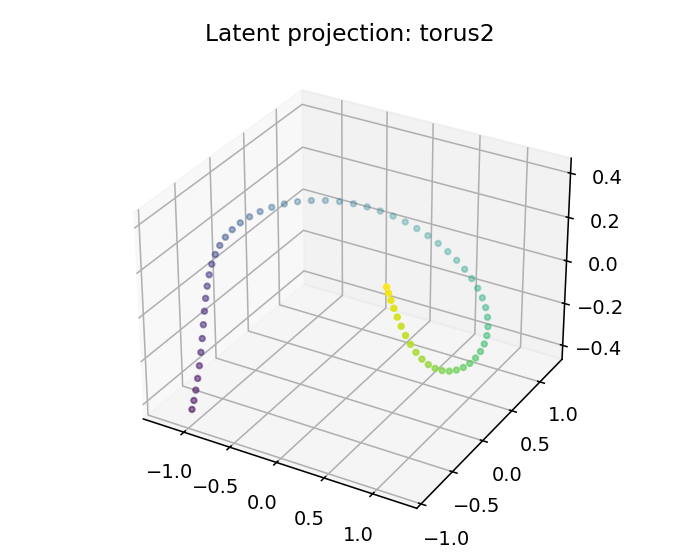
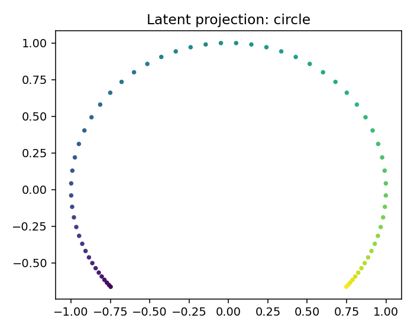
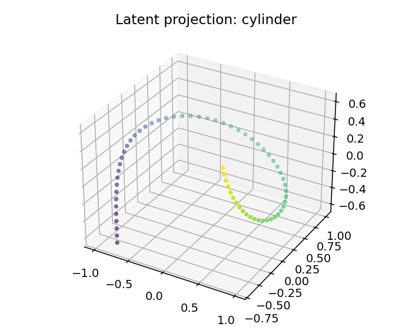

# ESO Report — harmonic

## 1. Resumen ejecutivo
- Mejor geometría candidata: **sphere2**
- Score: `0.0003991638252325498`
- Error reconstrucción: `0.0003991363252325498`
- Dimensión intrínseca estimada: `3.0`
- Resumen diagnóstico: intrinsic_dimension≈3.000; stationarity=trend_or_unit_root; lyapunov=0.0000; chaotic_hint=True; periodic_hint=False; dominant_frequency=0.0156

## 2. Datos de entrada
- Fuente: `<dataframe>`
- Shape: `[64, 3]`
- Columnas usadas: `['t', 'x', 'y']`

## 3. Ranking topológico
| rank | manifold | score | recon_error | std | smoothness | utilization |
|---:|---|---:|---:|---:|---:|---:|
| 1 | sphere2 | 0.000399164 | 0.000399136 | 0.000343355 | 0.0492985 | 0.75 |
| 2 | torus2 | 0.000554362 | 0.000554334 | 0.000390924 | 0.0504945 | 0.75 |
| 3 | circle | 0.000932862 | 0.000932847 | 0.000514319 | 0.0516905 | 0.53125 |
| 4 | cylinder | 0.00109607 | 0.00109604 | 0.000530658 | 0.0492985 | 0.6875 |

## 4. Visualizaciones
### time_series_overview

### recurrence_plot

### fft_spectrum

### autocorrelation

### manifold_ranking

### latent_projection_sphere2

### latent_projection_torus2

### latent_projection_circle

### latent_projection_cylinder

## 5. Interpretación
Best current candidate is sphere2 with intrinsic dimension estimate 3.0.

Acción recomendada: Inspect report.html and run a second explore pass with more rows/masks if confidence is not high.