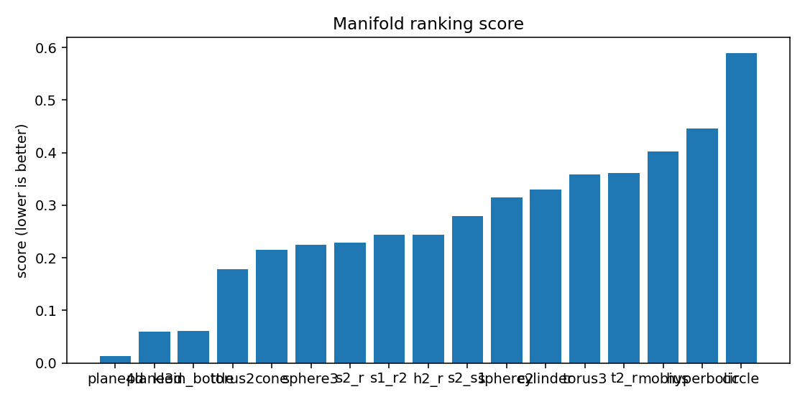
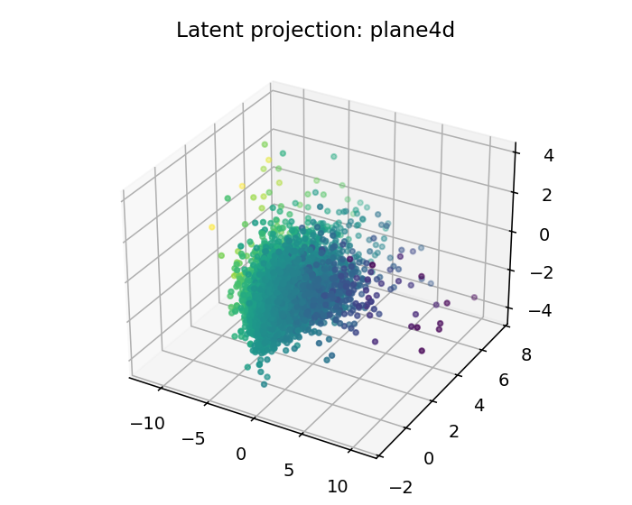

# ESO Report — BTC_1h_early_full

## 1. Resumen ejecutivo
- Mejor geometría candidata: **plane4d**
- Score: `0.01259288706140175`
- Error reconstrucción: `0.012592837061401749`
- Dimensión intrínseca estimada: `4.0`
- Resumen diagnóstico: intrinsic_dimension≈4.000; stationarity=stationary; lyapunov=0.0510; chaotic_hint=True; periodic_hint=False; dominant_frequency=0.3168

## 2. Datos de entrada
- Fuente: `<dataframe>`
- Shape: `[9999, 4]`
- Columnas usadas: `['log_return', 'vol_20', 'vwap_dev', 'volume_imbalance']`

## 3. Ranking topológico
| rank | manifold | score | recon_error | std | smoothness | utilization |
|---:|---|---:|---:|---:|---:|---:|
| 1 | plane4d | 0.0125929 | 0.0125928 | 0.00104151 | 0.175897 | 0.0806081 |
| 2 | plane3d | 0.0592789 | 0.0592788 | 0.00462616 | 0.467244 | 0.20081 |
| 3 | klein_bottle | 0.0614303 | 0.0614302 | 0.00380685 | 0.467244 | 0.20081 |
| 4 | torus2 | 0.178816 | 0.178816 | 0.0121744 | 1.2398 | 0.385995 |
| 5 | cone | 0.214459 | 0.214459 | 0.00655568 | 1.42817 | 0.0972222 |
| 6 | sphere3 | 0.225055 | 0.225055 | 0.0134658 | 1.6666 | 0.306731 |
| 7 | s2_r | 0.229336 | 0.229336 | 0.0180548 | 1.66933 | 0.159916 |
| 8 | s1_r2 | 0.243117 | 0.243117 | 0.0160147 | 1.76828 | 0.0948095 |
| 9 | h2_r | 0.244438 | 0.244438 | 0.0124746 | 1.70534 | 0.446181 |
| 10 | s2_s1 | 0.279699 | 0.279699 | 0.014114 | 1.9318 | 0.110711 |
| 11 | sphere2 | 0.314432 | 0.314432 | 0.0118726 | 2.13966 | 0.340856 |
| 12 | cylinder | 0.329271 | 0.329271 | 0.0122254 | 2.30612 | 0.189236 |
| 13 | torus3 | 0.358673 | 0.358673 | 0.022273 | 2.41116 | 0.176318 |
| 14 | t2_r | 0.361108 | 0.361108 | 0.0152581 | 2.41116 | 0.176318 |
| 15 | mobius | 0.401433 | 0.401433 | 0.0254086 | 2.52957 | 0.207755 |
| 16 | hyperbolic | 0.445443 | 0.445443 | 0.0184793 | 2.8158 | 0.916667 |
| 17 | circle | 0.589303 | 0.589303 | 0.0267053 | 3.56253 | 0.305556 |

## 4. Visualizaciones
### time_series_overview

### recurrence_plot

### fft_spectrum

### autocorrelation

### manifold_ranking

### latent_projection_plane4d

### latent_projection_plane3d

### latent_projection_klein_bottle

### latent_projection_torus2

## 5. Interpretación
Best current candidate is plane4d with intrinsic dimension estimate 4.0.

Acción recomendada: Inspect report.html and run a second explore pass with more rows/masks if confidence is not high.