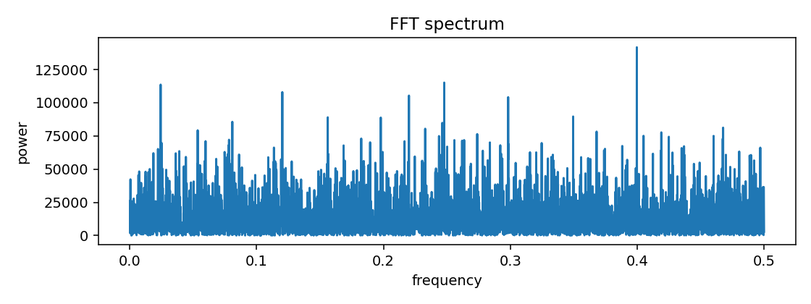
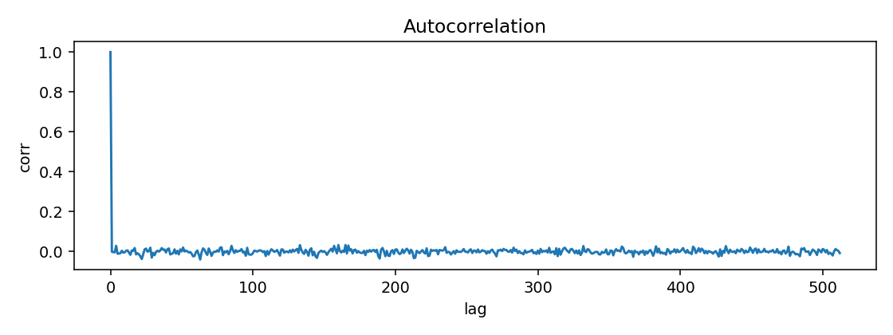
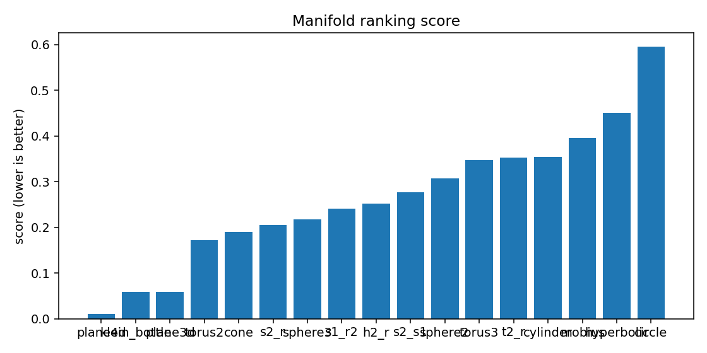
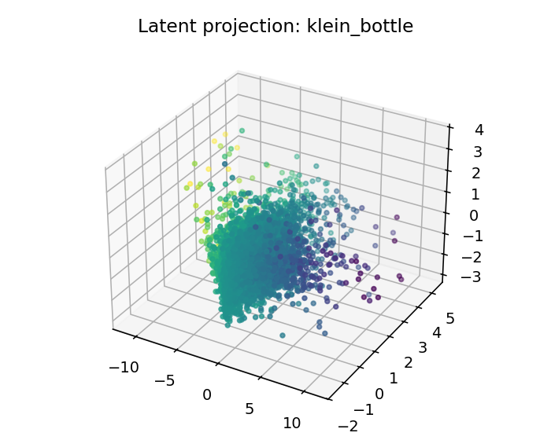

# ESO Report — BTC_1h_late_full

## 1. Resumen ejecutivo
- Mejor geometría candidata: **plane4d**
- Score: `0.010469886445155206`
- Error reconstrucción: `0.010469836445155204`
- Dimensión intrínseca estimada: `4.0`
- Resumen diagnóstico: intrinsic_dimension≈4.000; stationarity=stationary; lyapunov=0.0519; chaotic_hint=True; periodic_hint=False; dominant_frequency=0.3996

## 2. Datos de entrada
- Fuente: `<dataframe>`
- Shape: `[9999, 4]`
- Columnas usadas: `['log_return', 'vol_20', 'vwap_dev', 'volume_imbalance']`

## 3. Ranking topológico
| rank | manifold | score | recon_error | std | smoothness | utilization |
|---:|---|---:|---:|---:|---:|---:|
| 1 | plane4d | 0.0104699 | 0.0104698 | 0.00105928 | 0.153275 | 0.0841084 |
| 2 | klein_bottle | 0.0589326 | 0.0589326 | 0.00254801 | 0.455811 | 0.251157 |
| 3 | plane3d | 0.0592676 | 0.0592675 | 0.00267759 | 0.455811 | 0.251157 |
| 4 | torus2 | 0.171708 | 0.171708 | 0.00671905 | 1.20415 | 0.384259 |
| 5 | cone | 0.190474 | 0.190474 | 0.00440884 | 1.32823 | 0.102431 |
| 6 | s2_r | 0.204692 | 0.204692 | 0.0105673 | 1.51916 | 0.137714 |
| 7 | sphere3 | 0.217835 | 0.217835 | 0.0136473 | 1.61179 | 0.309531 |
| 8 | s1_r2 | 0.241258 | 0.241258 | 0.00635216 | 1.75223 | 0.0860086 |
| 9 | h2_r | 0.25212 | 0.25212 | 0.00643948 | 1.79988 | 0.494213 |
| 10 | s2_s1 | 0.277054 | 0.277054 | 0.0134228 | 1.87969 | 0.109911 |
| 11 | sphere2 | 0.307633 | 0.307633 | 0.0188678 | 2.16211 | 0.343171 |
| 12 | torus3 | 0.347532 | 0.347532 | 0.0162649 | 2.4079 | 0.174517 |
| 13 | t2_r | 0.352312 | 0.352312 | 0.0151592 | 2.4079 | 0.174517 |
| 14 | cylinder | 0.35339 | 0.353389 | 0.0168838 | 2.42507 | 0.208912 |
| 15 | mobius | 0.39575 | 0.39575 | 0.018768 | 2.44645 | 0.209491 |
| 16 | hyperbolic | 0.449941 | 0.449941 | 0.0172591 | 2.81674 | 0.916667 |
| 17 | circle | 0.595701 | 0.5957 | 0.0183223 | 3.57513 | 0.305556 |

## 4. Visualizaciones
### time_series_overview

### recurrence_plot

### fft_spectrum

### autocorrelation

### manifold_ranking

### latent_projection_plane4d

### latent_projection_klein_bottle

### latent_projection_plane3d

### latent_projection_torus2

## 5. Interpretación
Best current candidate is plane4d with intrinsic dimension estimate 4.0.

Acción recomendada: Inspect report.html and run a second explore pass with more rows/masks if confidence is not high.