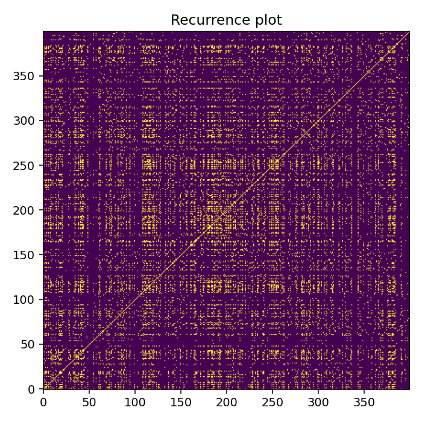
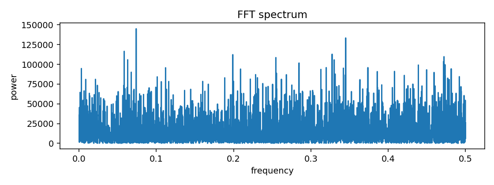
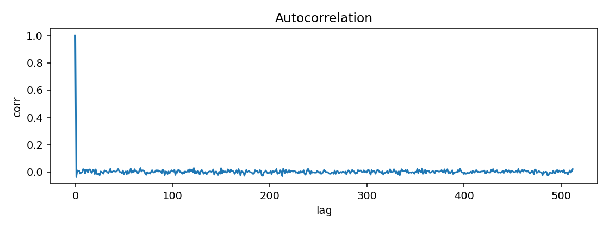
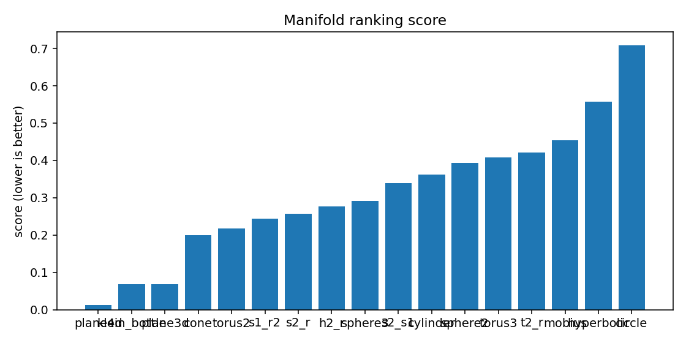
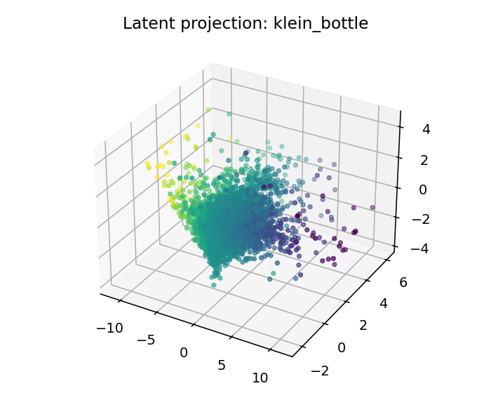

# ESO Report — BTC_1h_mid_full

## 1. Resumen ejecutivo
- Mejor geometría candidata: **plane4d**
- Score: `0.012377872626014965`
- Error reconstrucción: `0.012377822626014964`
- Dimensión intrínseca estimada: `3.941986960388802`
- Resumen diagnóstico: intrinsic_dimension≈3.942; stationarity=stationary; lyapunov=0.0538; chaotic_hint=True; periodic_hint=False; dominant_frequency=0.0739

## 2. Datos de entrada
- Fuente: `<dataframe>`
- Shape: `[9999, 4]`
- Columnas usadas: `['log_return', 'vol_20', 'vwap_dev', 'volume_imbalance']`

## 3. Ranking topológico
| rank | manifold | score | recon_error | std | smoothness | utilization |
|---:|---|---:|---:|---:|---:|---:|
| 1 | plane4d | 0.0123779 | 0.0123778 | 0.00172044 | 0.174946 | 0.0684068 |
| 2 | klein_bottle | 0.0679064 | 0.0679063 | 0.00298744 | 0.513486 | 0.206597 |
| 3 | plane3d | 0.0686561 | 0.0686561 | 0.00476862 | 0.513486 | 0.206597 |
| 4 | cone | 0.199645 | 0.199645 | 0.00354829 | 1.38119 | 0.10706 |
| 5 | torus2 | 0.218029 | 0.218029 | 0.0133893 | 1.49788 | 0.372685 |
| 6 | s1_r2 | 0.244101 | 0.244101 | 0.00989358 | 1.8389 | 0.0723072 |
| 7 | s2_r | 0.257246 | 0.257246 | 0.0125847 | 1.99594 | 0.127413 |
| 8 | h2_r | 0.276214 | 0.276214 | 0.0115661 | 1.9767 | 0.429977 |
| 9 | sphere3 | 0.290709 | 0.290708 | 0.0172167 | 2.10218 | 0.30393 |
| 10 | s2_s1 | 0.339232 | 0.339232 | 0.0166614 | 2.4219 | 0.107411 |
| 11 | cylinder | 0.361935 | 0.361935 | 0.0201277 | 2.56217 | 0.185185 |
| 12 | sphere2 | 0.393826 | 0.393826 | 0.0225775 | 2.72008 | 0.335069 |
| 13 | torus3 | 0.408102 | 0.408102 | 0.0190967 | 2.8771 | 0.173417 |
| 14 | t2_r | 0.420849 | 0.420849 | 0.0228323 | 2.8771 | 0.173417 |
| 15 | mobius | 0.453641 | 0.453641 | 0.012173 | 2.98708 | 0.211806 |
| 16 | hyperbolic | 0.556807 | 0.556807 | 0.0204923 | 3.44346 | 0.916667 |
| 17 | circle | 0.708701 | 0.708701 | 0.030679 | 4.24703 | 0.305556 |

## 4. Visualizaciones
### time_series_overview

### recurrence_plot

### fft_spectrum

### autocorrelation

### manifold_ranking

### latent_projection_plane4d

### latent_projection_klein_bottle

### latent_projection_plane3d

### latent_projection_cone

## 5. Interpretación
Best current candidate is plane4d with intrinsic dimension estimate 3.941986960388802.

Acción recomendada: Inspect report.html and run a second explore pass with more rows/masks if confidence is not high.