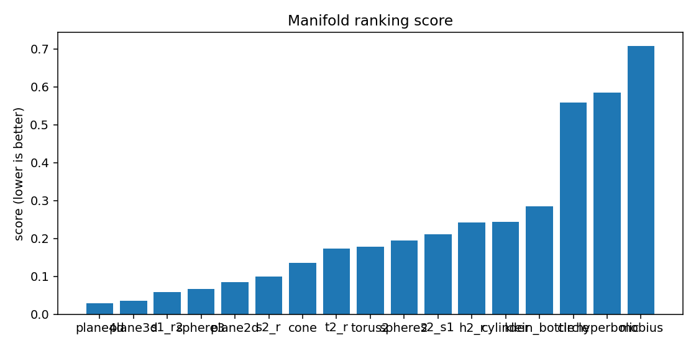
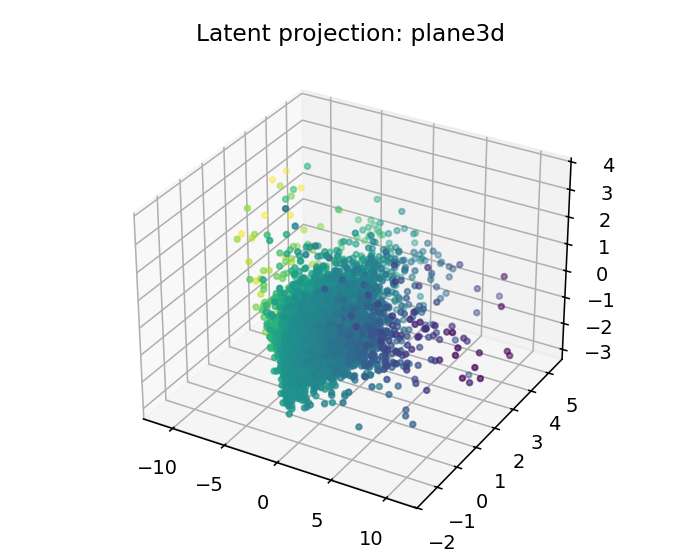
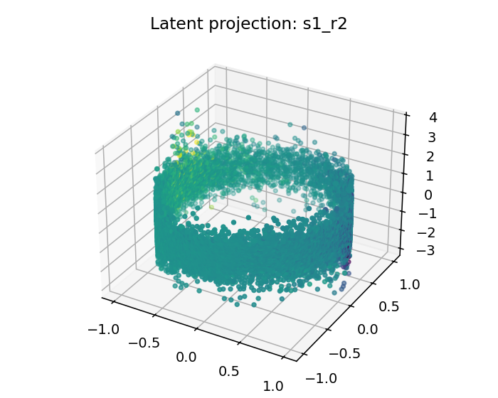
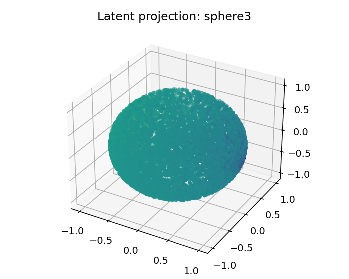

# ESO Report — BTC_1h_late_umap

## 1. Resumen ejecutivo
- Mejor geometría candidata: **plane4d**
- Score: `0.02906094467977869`
- Error reconstrucción: `0.02906089467977869`
- Dimensión intrínseca estimada: `4.0`
- Resumen diagnóstico: intrinsic_dimension≈4.000; stationarity=stationary; lyapunov=0.0519; chaotic_hint=True; periodic_hint=False; dominant_frequency=0.3996

## 2. Datos de entrada
- Fuente: `<dataframe>`
- Shape: `[9999, 4]`
- Columnas usadas: `['log_return', 'vol_20', 'vwap_dev', 'volume_imbalance']`

## 3. Ranking topológico
| rank | manifold | score | recon_error | std | smoothness | utilization |
|---:|---|---:|---:|---:|---:|---:|
| 1 | plane4d | 0.0290609 | 0.0290609 | 0.00127891 | 0.263301 | 0.152215 |
| 2 | plane3d | 0.0348746 | 0.0348746 | 0.00177132 | 0.312232 | 0.383102 |
| 3 | s1_r2 | 0.0588638 | 0.0588638 | 0.00270487 | 0.487142 | 0.10251 |
| 4 | sphere3 | 0.0663555 | 0.0663554 | 0.00246301 | 0.567939 | 0.116112 |
| 5 | plane2d | 0.0846993 | 0.0846993 | 0.00249404 | 0.644777 | 0.916667 |
| 6 | s2_r | 0.0991994 | 0.0991993 | 0.00383381 | 0.891535 | 0.0889089 |
| 7 | cone | 0.135709 | 0.135709 | 0.00170808 | 0.975136 | 0.135417 |
| 8 | t2_r | 0.172826 | 0.172826 | 0.0085444 | 1.25556 | 0.0351035 |
| 9 | torus2 | 0.17834 | 0.17834 | 0.00696959 | 1.29865 | 0.12037 |
| 10 | sphere2 | 0.194583 | 0.194583 | 0.0247313 | 1.44059 | 0.146412 |
| 11 | s2_s1 | 0.210882 | 0.210882 | 0.00879613 | 1.52819 | 0.0248025 |
| 12 | h2_r | 0.241453 | 0.241453 | 0.00763645 | 1.74084 | 0.119213 |
| 13 | cylinder | 0.243747 | 0.243747 | 0.00788417 | 1.82253 | 0.118634 |
| 14 | klein_bottle | 0.284947 | 0.284947 | 0.037806 | 1.70478 | 0.0428241 |
| 15 | circle | 0.558417 | 0.558417 | 0.0483875 | 3.9164 | 0.159722 |
| 16 | hyperbolic | 0.584806 | 0.584806 | 0.0429128 | 3.76815 | 0.159722 |
| 17 | mobius | 0.708253 | 0.708253 | 0.0236909 | 4.19515 | 0.0231481 |

## 4. Visualizaciones
### time_series_overview

### recurrence_plot

### fft_spectrum

### autocorrelation

### manifold_ranking

### latent_projection_plane4d

### latent_projection_plane3d

### latent_projection_s1_r2

### latent_projection_sphere3

## 5. Interpretación
Best current candidate is plane4d with intrinsic dimension estimate 4.0.

Acción recomendada: Inspect report.html and run a second explore pass with more rows/masks if confidence is not high.